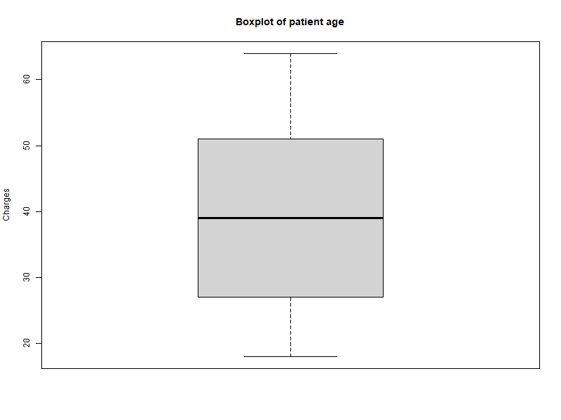
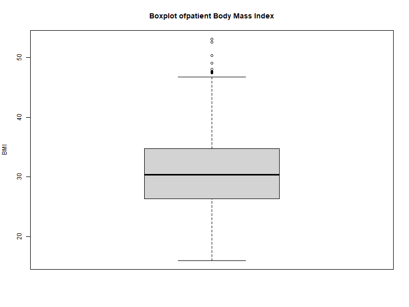
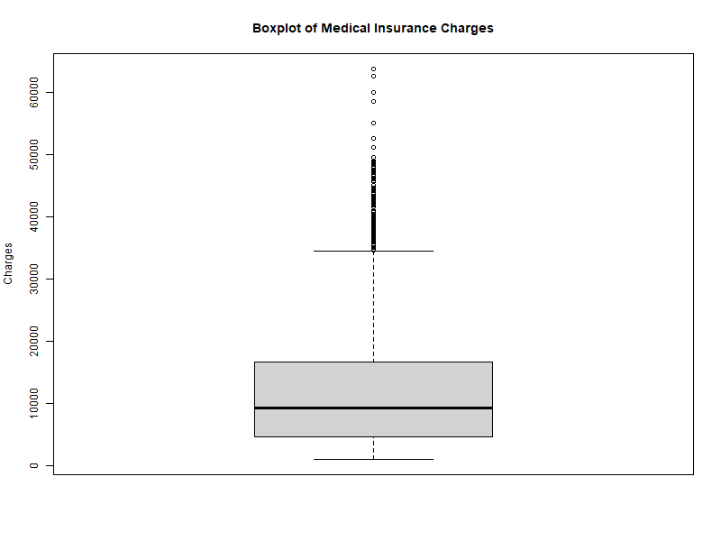
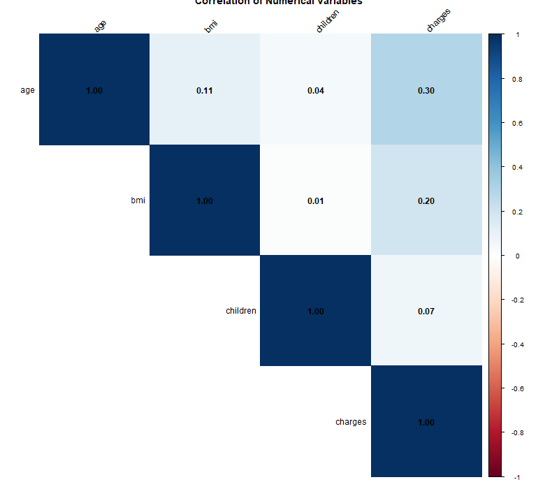
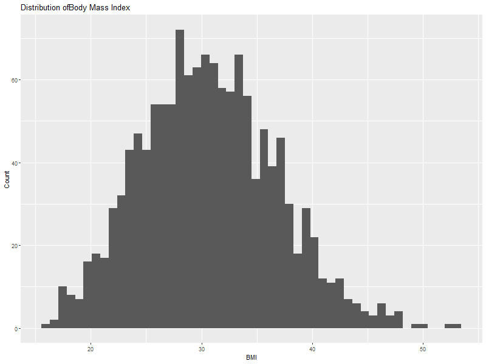
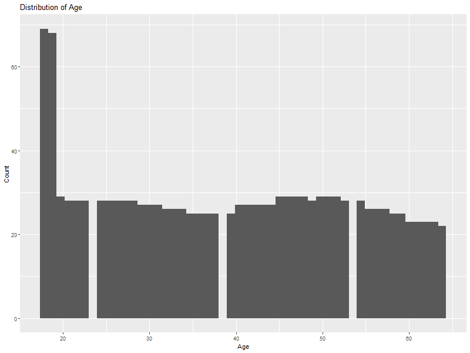
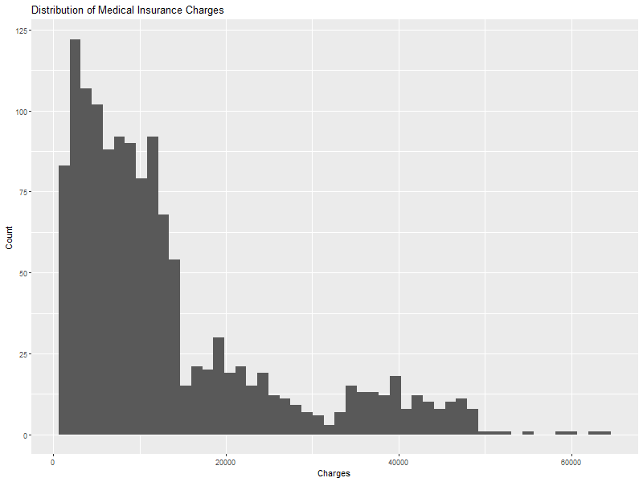
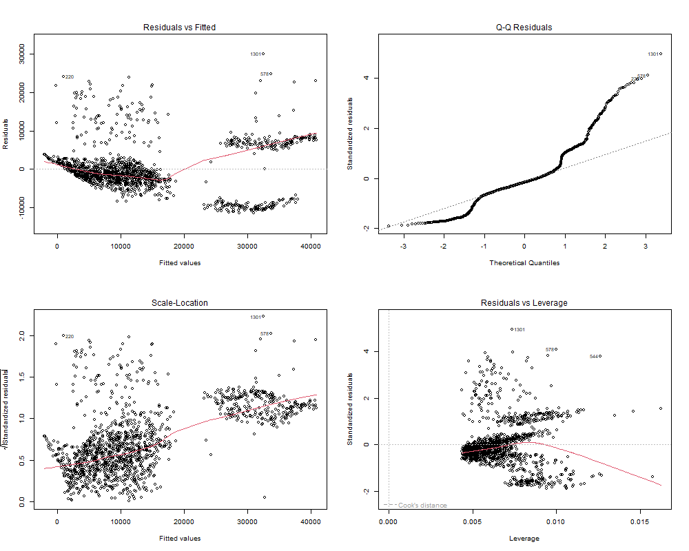

```{r, echo = FALSE}
model_gamma_final   <- readRDS("models/model_gamma_final.rds")
model_interaction   <- readRDS("models/model_interaction.rds")
model_linear        <- readRDS("models/model_linear.rds")
log_interaction_lm  <- readRDS("models/log_interaction_lm.rds")

```

Medical costs represent a significant financial burden for individuals and are a primary reason health insurance coverage is widely sought. Accurately understanding the factors that drive medical insurance charges is essential for insurers seeking to price plans fairly and sustainably, as well as for policymakers concerned with healthcare affordability. This paper aims to model the relationship between individual medical insurance costs and selected demographic, health-related, and behavioral indicators using linear regression techniques. Using a dataset of insured individuals in the United States, we examine how factors such as age, body mass index (BMI), smoking status, number of dependents, and geographic region influence medical charges. Multiple regression models are developed and evaluated to identify statistically significant predictors and assess model assumptions. The results provide interpretable insights into the primary drivers of medical insurance costs and demonstrate the usefulness of regression modeling in health economics and insurance pricing applications.

## **Abstract**

Medical insurance costs are highly variable, right-skewed, and influenced by both demographic and behavioral factors. Accurately modeling these costs is essential for insurers seeking to price risk fairly and sustainably. This study examines the relationship between medical insurance charges and individual characteristics using regression-based approaches. Using a dataset of 1,338 insured individuals in the United States, we evaluate ordinary least squares regression, interaction models, robust regression, and generalized linear models. Due to the skewed and heteroskedastic nature of cost data, a Gamma generalized linear model with a log link and selected interaction terms was chosen as the final specification. Results indicate that smoking status is the dominant driver of medical costs and significantly amplifies the effect of body mass index. The final model demonstrates strong predictive performance on a held-out test set and provides interpretable insights relevant for insurance pricing and risk assessment.

## **1. Introduction**

Rising healthcare costs present a significant financial challenge for individuals, insurers, and policymakers. Medical insurance premiums are typically based on expected healthcare utilization, which in turn depends on demographic characteristics, health indicators, and behavioral risk factors. Understanding how these factors jointly influence medical costs is critical for effective risk pricing and sustainable insurance design.

Traditional linear regression models are often used to analyze cost data due to their interpretability; however, medical costs violate many classical regression assumptions. Costs are strictly positive, right-skewed, and characterized by a small number of high-cost individuals who account for a disproportionate share of total expenditures. As a result, naïve linear regression may produce biased inference and poor predictive performance.

This study addresses these challenges by applying regression techniques tailored to cost data. Specifically, we investigate whether smoking status modifies the effects of other predictors—particularly body mass index—on medical insurance charges. The objective is twofold: (1) to identify key drivers of medical costs and (2) to develop a predictive model that balances interpretability with statistical appropriateness.

## **2. Literature Review**

Modeling healthcare expenditures presents significant econometric challenges due to the inherently skewed and heavy-tailed nature of cost data. Medical expenditures are characterized by a large mass of low-cost observations and a long right tail of extremely high costs. These features are commonly associated with heteroscedastic error structures, leading to frequent violations of the homoscedasticity assumption in ordinary least squares regression.

A common response is to apply a logarithmic transformation to costs and estimate a linear model on the transformed scale. However, this approach introduces important limitations. Zero-cost observations cannot be accommodated without ad hoc adjustments, and retransformation bias arises when predicted log-costs are exponentiated to recover expected costs on the original scale. As shown by Manning (1998), this bias persists under heteroscedasticity, which is common even after log transformation. While smearing estimators may partially address this issue (Duan, 1983; Duan et al., 1983), they rely on additional assumptions and do not fully resolve model misspecification (Manning, 1998).

Generalized linear models provide a more appropriate framework for modeling healthcare costs (Blough et al., 1999; Deb & Trivedi, 2002). By allowing the response variable to follow a distribution from the exponential dispersion family, GLMs explicitly accommodate the skewed and heteroscedastic nature of cost data (Glick et al., 2014). In particular, the Gamma distribution with a log link is well suited for continuous, positive expenditures, as it naturally models variance proportional to the square of the mean and ensures positive predictions (Blough et al., 1999; Deb & Trivedi, 2002). Coefficients from such models admit a straightforward multiplicative interpretation in terms of percentage changes in expected cost (Glick et al., 2014).

Consistent with prior literature, our analysis highlights smoking status as a dominant cost driver and demonstrates that its effect interacts strongly with body mass index. This finding aligns with evidence that health risk factors operate synergistically rather than independently (Manning et al., 1987; Deb & Trivedi, 2002). Age and family structure also exhibit significant relationships with medical expenditures, reflecting systematic differences in healthcare utilization documented in prior studies (Blough et al., 1999; Glick et al., 2014).

Overall, the use of a Gamma generalized linear model with targeted interaction terms aligns with best practices in health econometrics, yielding consistent estimates and improved efficiency relative to misspecified linear models (Manning, 1998; Blough et al., 1999; Deb & Trivedi, 2002).

## **3. Methodology**

### **3.1 Data**

The dataset is found from the online Data Science community Kaggle.com. A link to the exact download source is provided in the Appendix.

The dataset consists of 1,338 individuals covered by medical insurance in the United States. The response variable is annual medical insurance charges. Predictor variables include age, sex, body mass index (BMI), smoking status, number of dependents (recoded as a binary indicator for having children), and residential region.

All variables were complete with no missing observations. Categorical predictors were encoded as factor variables prior to model estimation. The number of children was originally measured as a numeric variable and was subsequently recoded as a binary indicator reflecting the presence of dependents.

### **3.2 Exploratory Analysis**

Exploratory data analysis revealed that medical charges are heavily right-skewed, with a long upper tail corresponding to high-cost individuals. Boxplots and residual diagnostics confirmed the presence of heteroskedasticity and non-normality, consistent with the known characteristics of healthcare cost data. These patterns motivated the use of modeling approaches beyond ordinary least squares regression.

### **3.3 Model Specification**

**Several models were estimated and compared:**

Ordinary least squares regression on raw charges

Linear regression with interaction terms

Robust regression to assess sensitivity to outliers

Gamma generalized linear models with a log link

To assess effect heterogeneity, interaction terms between smoking status and other predictors were explored. While smoking significantly modified the effects of BMI, age, and dependent status, interactions with sex and region did not materially improve model fit.

The final model specification was a **Gamma generalized linear model with a log link** including the following predictors: Age, BMI, Smoking status,Having children, Sex, Region, Smoking × BMI, Smoking, Age, Smoking × Having children

### **3.4 Model Evaluation**

The dataset was split into training (70%) and testing (30%) subsets. Model performance was evaluated on the test set using root mean squared error (RMSE) and mean absolute error (MAE), with predictions generated on the original cost scale using the inverse log link.

## **4. Results**

The final Gamma model demonstrated strong explanatory power, reducing deviance substantially relative to a null model and achieving a deviance-based pseudo-R² of approximately 0.73.

Smoking status emerged as the dominant predictor of medical costs. Holding other factors constant, smokers incur nearly three times the expected medical costs of non-smokers. Body mass index alone had little effect among non-smokers; however, for smokers, each additional BMI unit increased expected medical costs by approximately 5%. This interaction indicates that smoking substantially amplifies the cost impact of obesity.

Age was also a significant predictor, with expected medical costs increasing by roughly 3–4% per additional year for non-smokers. The interaction between smoking and age suggested that the marginal effect of age is attenuated among smokers, likely reflecting their already elevated baseline risk. Having dependents increased expected costs for non-smokers, though this effect was weaker among smokers.

On the held-out test set, the model achieved an RMSE of approximately \$5,200 and an MAE of approximately \$3,170. A predicted-versus-actual plot showed good calibration across most of the cost distribution, with increased dispersion among very high-cost individuals.

## **5. Discussion**

The results highlight smoking as the most influential driver of medical insurance costs, both directly and through its interaction with BMI and age. From a business perspective, these findings support risk-adjusted pricing strategies that account not only for smoking status but also for how smoking interacts with other health indicators.

The strong interaction between smoking and BMI suggests that wellness interventions targeting weight management among smokers may yield disproportionately large cost savings. Insurers may also benefit from differentiated premium structures or targeted preventive care programs for high-risk subgroups identified by the model.

## **6. Limitations**

Several limitations should be noted. The dataset does not include detailed clinical variables such as diagnosed conditions or healthcare utilization patterns, which likely explain much of the remaining variation in high-cost cases. Additionally, the analysis focuses on expected costs rather than extreme tail risk, which may be of interest for reinsurance or catastrophic coverage modeling.

## **7. Conclusion**

This study demonstrates that medical insurance costs can be effectively modeled using regression-based approaches when the distributional characteristics of cost data are properly addressed. A Gamma generalized linear model with targeted interaction terms provides a robust, interpretable framework for understanding cost drivers and predicting expected medical expenditures. The findings underscore the central role of **smoking** in healthcare costs and illustrate the value of interaction modeling in uncovering meaningful risk heterogeneity.

{fig-align="center" width="600"}

Medical insurance charges as a function of body mass index (BMI), stratified by smoking status. Points represent observed charges, while solid lines represent fitted values from the final Gamma generalized linear model with a log link and interaction between BMI and smoking status. Predicted values are shown on the original cost scale.

```         
The mdoel's rmse: 5198.975  The models mae 3170.379
```

## Appendices

### Tables and Figures

### Models

```{r}
summary(model_linear)
summary(model_interaction)

summary(log_interaction_lm)


```

##### Selected Model

```{r}
summary(model_gamma_final)
```

### Exploratory Plots

{fig-align="left" width="600"}

{fig-align="left" width="612"}

{fig-align="left" width="612"}

{fig-align="left" width="612"}

{fig-align="left" width="525"}

{fig-align="left" width="612"}

{fig-align="left" width="612"}

{width="612"}

### Model Diagnostic Plots

{fig-align="left" width="612"}

{fig-align="left" width="612"}

{fig-align="left" width="612"}

#### Model Selected

{fig-align="left" width="612"}

{fig-align="left" width="612"}

{fig-align="left" width="600"}

### References

Manning, W. G. (1998). The logged dependent variable, heteroscedasticity, and the retransformation problem. *Journal of Health Economics, 17*(3), 283–295. https://doi.org/10.1016/S0167-6296(98)00025-3

Blough, D. K., Madden, C. W., & Hornbrook, M. C. (1999). Modeling risk using generalized linear models. *Journal of Health Economics, 18*(2), 153–171. https://doi.org/10.1016/S0167-6296(98)00041-1

Deb, P., & Trivedi, P. K. (2002). The structure of demand for health care by the elderly: Econometric evidence from the Health and Retirement Study. *Journal of Health Economics, 21*(5), 803–824. https://doi.org/10.1016/S0167-6296(02)00021-7

Glick, H. A., Doshi, J. A., Sonnad, S. S., & Polsky, D. (2014). *Economic evaluation in clinical trials* (2nd ed.). Oxford University Press.

#### Data

Abdelghany, M. (2025). *Medical insurance cost dataset* \[Data set\]. Kaggle. <https://doi.org/10.34740/KAGGLE/DSV/12853160>

### R Code

[R code Link](https://github.com/DW8888/data621/blob/main/FinalProject/analysis.Rmd)

```         
```
