## Business Problem & Motivation

-   Medical Insurance costs are highly variable and difficult to predict

-   Accurate cost modeling is critical for:

    -   Insurance pricing

    -   Risk Assessment

    -   Preventive Strategies

        {width="201"}

## Statistical Challenges in Healthcare Cost Data

-   Medical cost data are:
    -   Highly right-skewed
    -   Heteroscedastic
        -   This is strututal, not noise(Deb & Trivedi, 2002)
    -   Strictly non-negative
-   These properties violate key assumptions of linear regression
-   Log-transformed OLS models introduce retransformation bias under heteroscedasticity(Manning, 1998)

## Data

-   Kaggle.com *Medical insurance cost dataset* \[Data set\]. Kaggle. <https://doi.org/10.34740/KAGGLE/DSV/12853160>

-   1,338 insured individuals in the U.S

    -   Reponse- Annaual medical insurance charges

    -   Predictors

        -   Age, BMI , Number of Dependants

        -   Smoker, Region, Dependents ( children)

## Exploratory Data Analysis

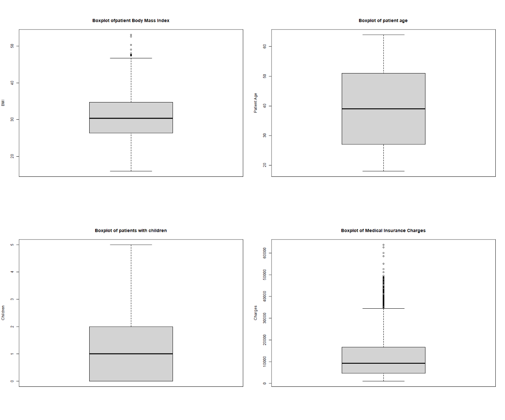

## 

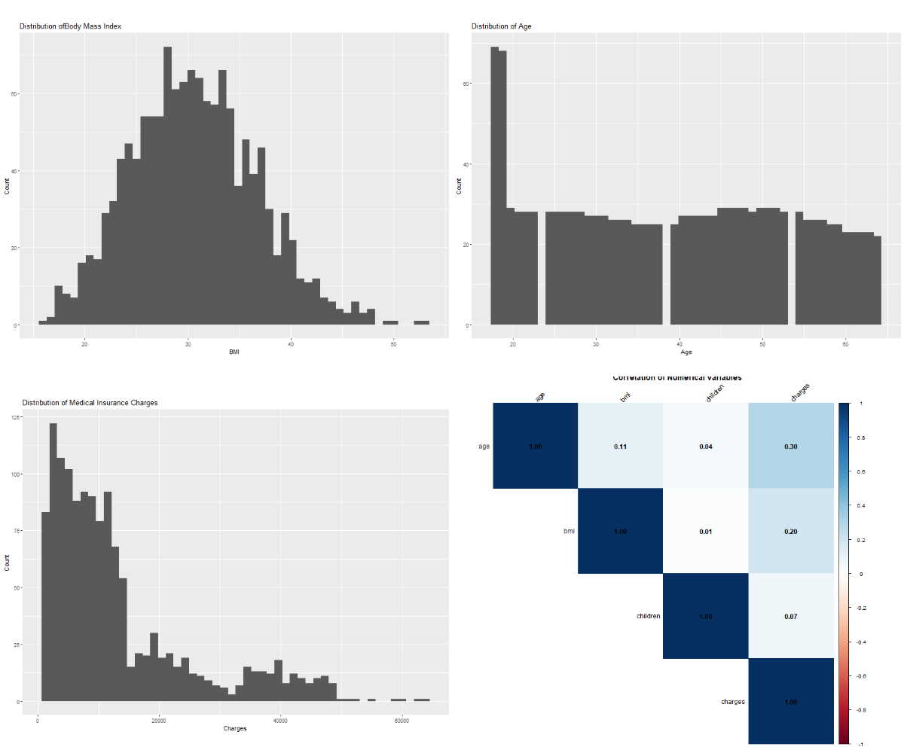

## 

::::: columns
::: {.column width="50%"}
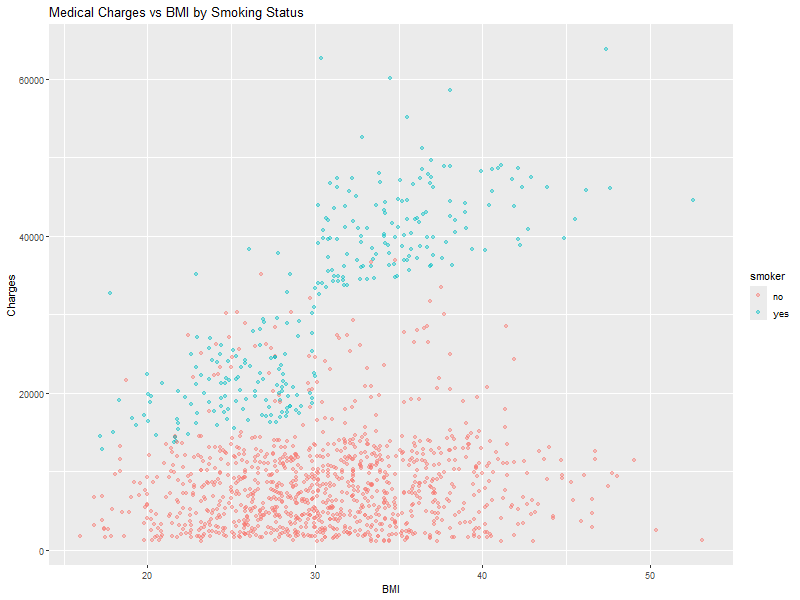
:::

::: {.column width="50%"}
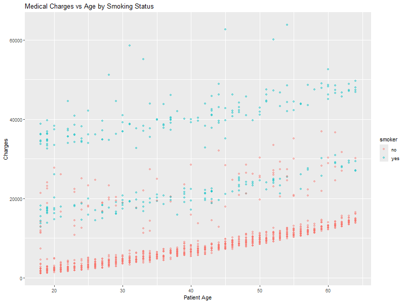
:::
:::::

## 

```{r, echo=FALSE, eval=TRUE}
library(tidyverse)
data_clean<- read.csv2("data_clean.csv")
data_clean <- data_clean |>
  mutate(across(where(is.character), as.factor))
cat_vars <- names(data_clean)[sapply(data_clean, is.factor)]

for (v in cat_vars) {
  cat("\n==============================\n")
  cat("Counts for Categorical Variables:", v, "\n")
  print(table(data_clean[[v]]))
 
}
 print("**Children was converted from a numerical value to a  binary factor indicating weather a person has atleast one child/dependant**")
```

## Data Preparation

-   No missing Values

-   Categorical values converted to factors

-   Children recoded to binary indicator has children vs no children

-   Data Split

    -   70/30

## Modeling Strategy

Multiple models were evaluated using an iterative and exploratory approach, including cross-validated ordinary least squares regression, interaction-based linear models, log- and square-root–transformed variants, and robust regression techniques. Despite these efforts, all linear specifications violated key assumptions required for valid linear regression, motivating the adoption of a generalized linear modeling framework.

Ultimately, a Gamma generalized linear model with a log link function was selected to model medical insurance costs.

## 

Linear model trained on 10 fold cross validation

charges \~ age + sex + bmi + has_children + smoker + region

::::: columns
::: {.column width="50%"}
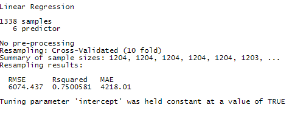{width="494"}
:::

::: {.column width="50%"}
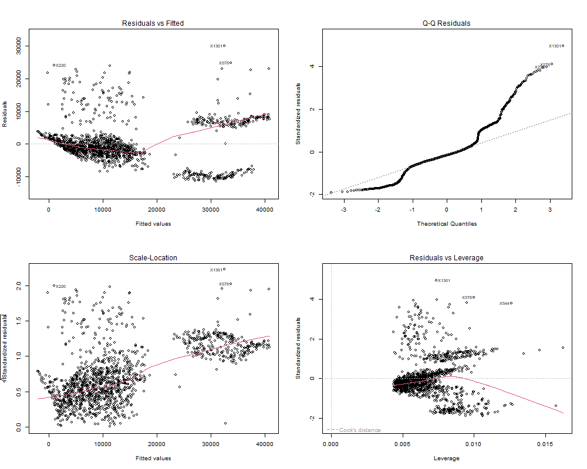
:::
:::::

## 

::::: columns
::: {.column width="50%"}
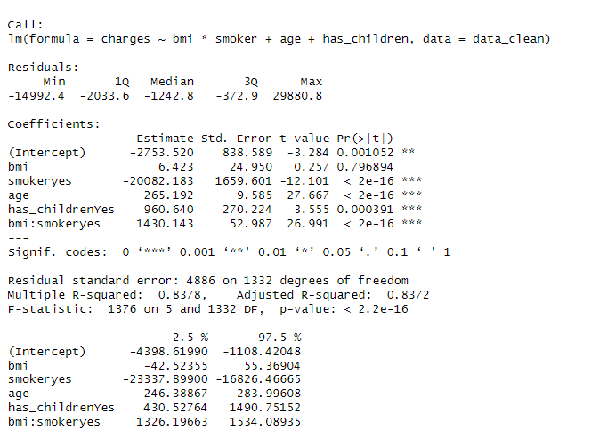
:::

::: {.column width="50%"}
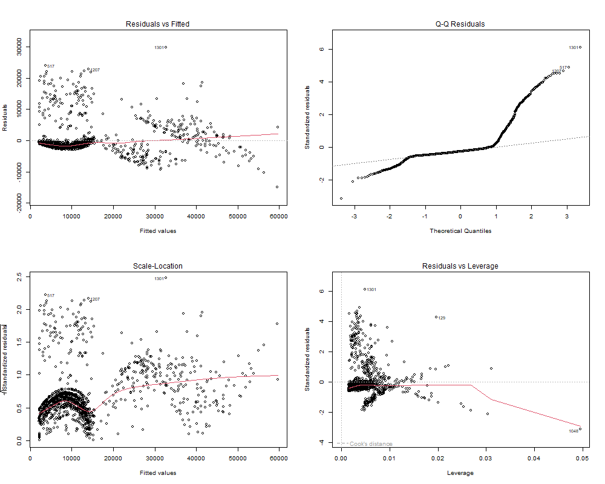
:::
:::::

## Other Models

::::: columns
::: {.column width="50%"}
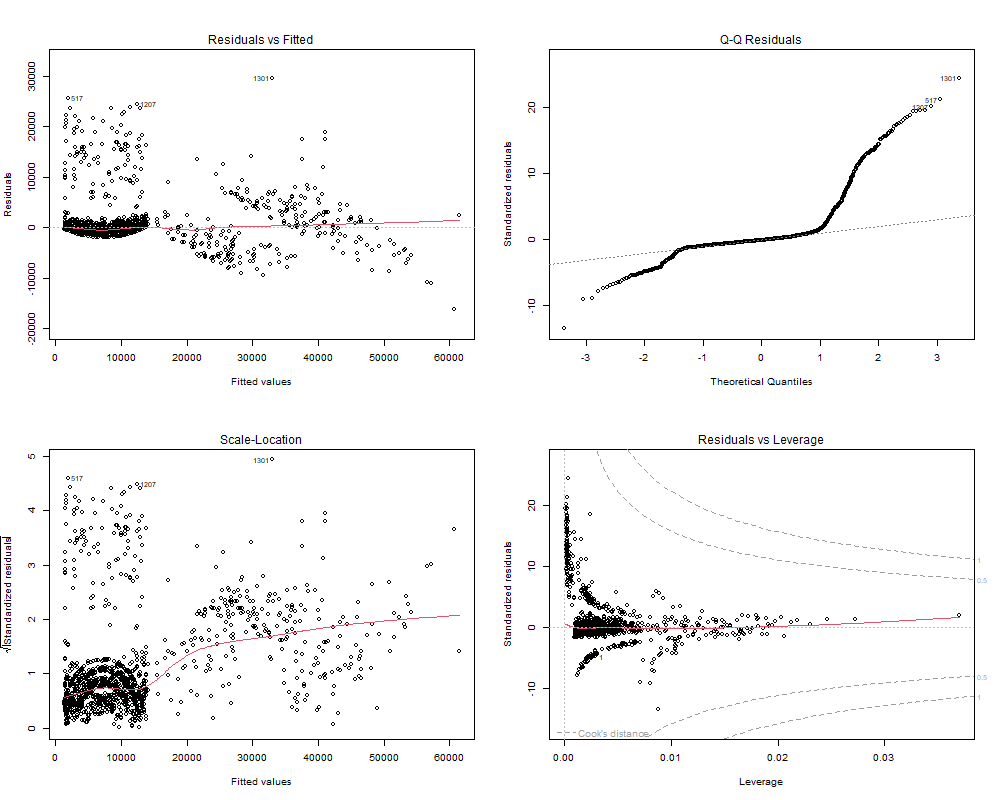
:::

::: {.column width="50%"}
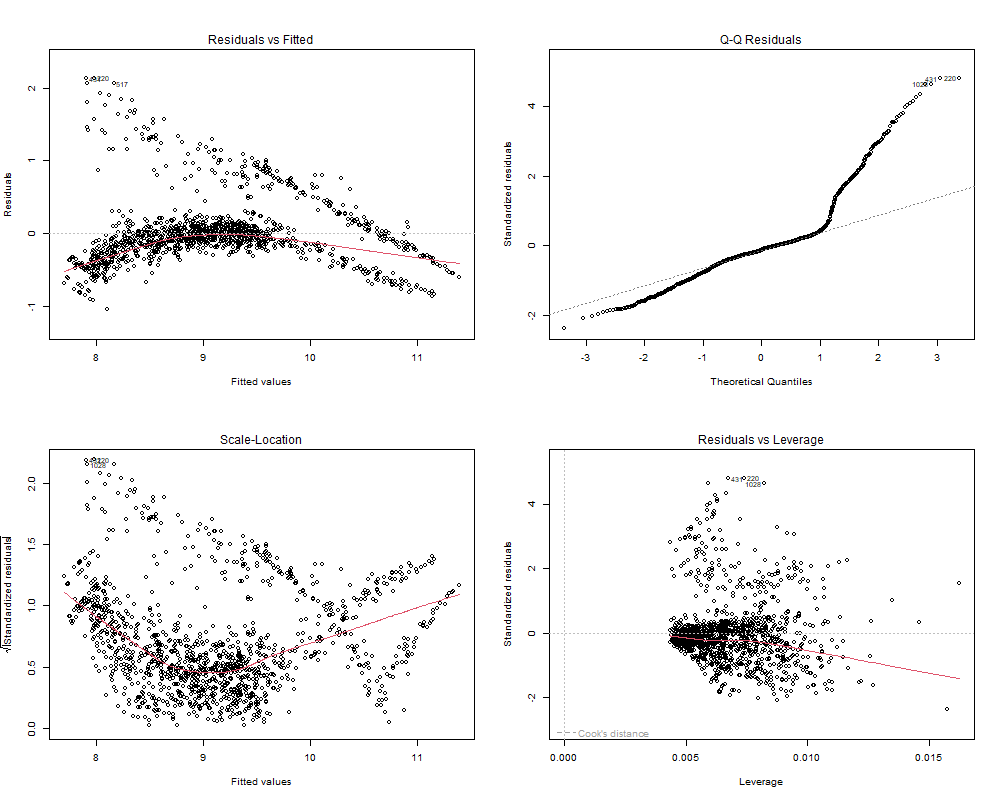
:::
:::::

## GLM Models

Generalized linear models (GLMs) extend traditional linear regression by allowing the response variable to follow a distribution from the exponential family and by linking the mean of the response to predictors through a flexible link function (McCullagh & Nelder, 1989).

In healthcare cost applications, Gamma GLMs with log links are widely recommended due to the positive, right-skewed, and heteroscedastic nature of expenditure data (Deb & Trivedi, 2002; Blough et al., 1999; Glick et al., 2014).

## 

::::: columns
::: {.column width="50%"}
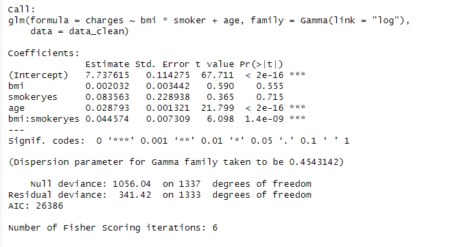
:::

::: {.column width="50%"}
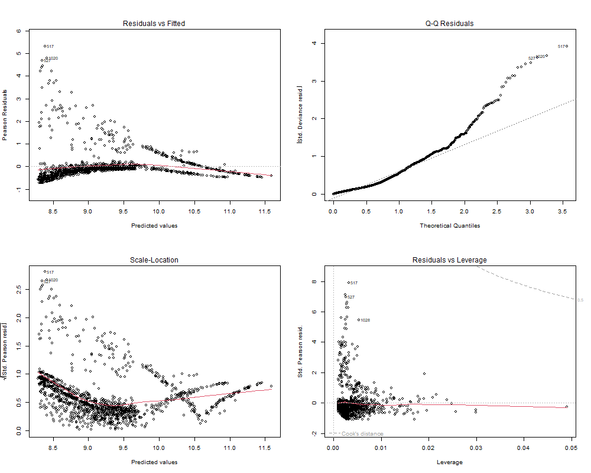
:::
:::::

## GLM with Smoking Interactions

::::: columns
::: {.column width="50%"}
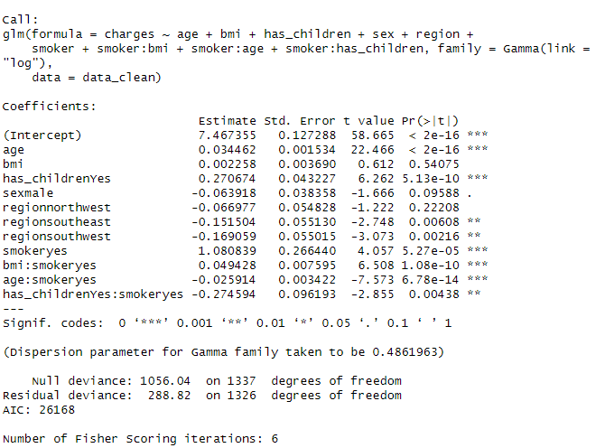
:::

::: {.column width="50%"}
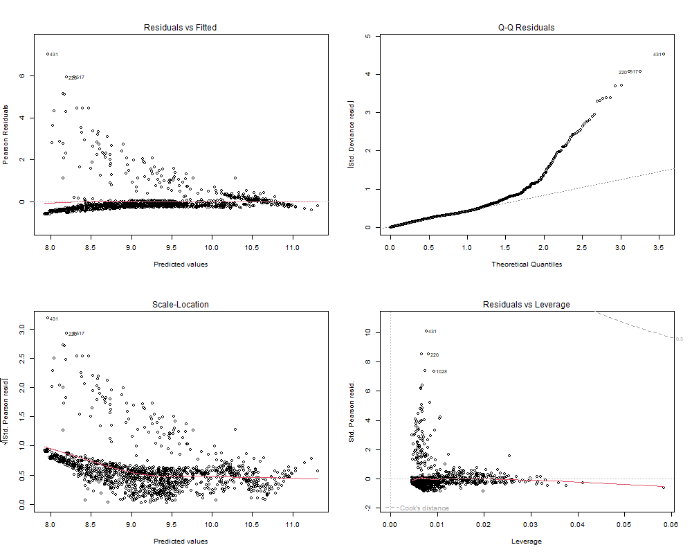
:::
:::::

## Results

Smoker has a tremendous impact on health charges and is extremely significant

BMI

-   stand alone no significant affect on health cost

-   significant applies effect when interacting with smokers

AGE significant positive cost effect

Interaction terms improve fit.

## Model Performance

Test-set evaluation:

RMSE ≈ **\$5,200**

MAE ≈ **\$3,170**

Deviance-based pseudo-R² ≈ **0.73**

## 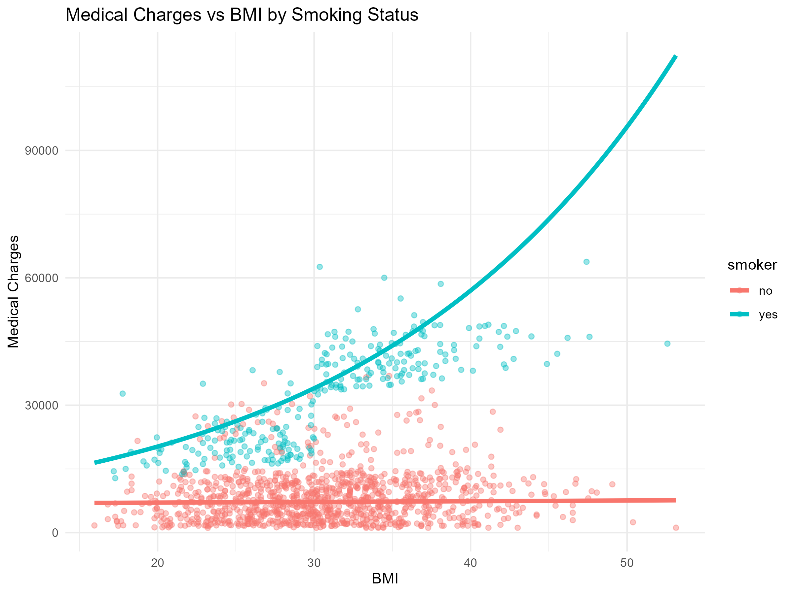

::: notes
This figure shows medical insurance charges as a function of body mass index, stratified by smoking status, with fitted values from the final Gamma generalized linear model. Among non-smokers, costs remain relatively stable across BMI levels, while among smokers, medical charges increase sharply as BMI rises, indicating a strong interaction effect. The Gamma GLM captures this nonlinear, multiplicative relationship more effectively than linear models.
:::

## 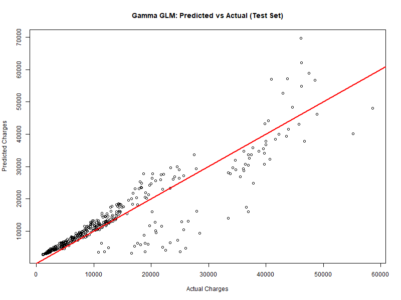

::: notes
Predicted charges align closely with observed values across most of the distribution, demonstrating strong generalization on the test set. Slight underprediction in the upper tail reflects the model’s focus on estimating mean costs rather than rare extreme expenditures.
:::

## Conclusion

-   Medical insurance costs violate key assumptions of linear regression

-   Linear and transformed-linear models failed to generalize adequately

-   A Gamma generalized linear model with a log link provided the best fit

-   Smoking status and BMI interact strongly to drive medical costs

-   The final model achieved strong predictive performance on unseen data

## Limitations and Future

-   Extreme high cost cases remian difficult to predict

    -   Model estimates mean costs- not higher values at the right tail of cost

-   Future work

    -   I would like to explore quantile regression and see how it compared to method explore here

## References

Blough, D. K., Madden, C. W., & Hornbrook, M. C. (1999). Modeling risk using generalized linear models. *Journal of Health Economics, 18*(2), 153–171. <https://doi.org/10.1016/s0167-6296(98)00032-0>

Deb, P., & Trivedi, P. K. (2002). The structure of demand for health care: Econometric evidence from the Health and Retirement Survey. *Journal of Health Economics, 21*(5), 803–833.<https://doi.org/10.1016/s0167-6296(02)00008-5>

Glick, H. A., Doshi, J. A., Sonnad, S. S., & Polsky, D. (2014). *Economic evaluation in clinical trials* (2nd ed.). Oxford University Press. <https://drhenryglick.com/wp-content/uploads/2021/05/SCT.econanalintrials.pdf>

Manning, W. G. (1998). The logged dependent variable, heteroscedasticity, and the retransformation problem. *Journal of Health Economics, 17*(3), 283–295. <https://doi.org/10.1016/S0167-6296(98)00025-3>

Mosap Abdelghany. (2025). *Medical insurance cost dataset* \[Data set\]. Kaggle. <https://doi.org/10.34740/KAGGLE/DSV/12853160>

## Thank you


